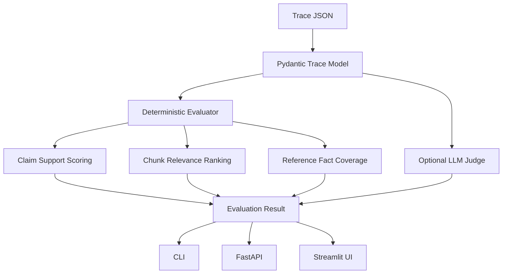

# LLM Trace Inspector

[](https://www.python.org/)
[](https://fastapi.tiangolo.com/)
[](https://typer.tiangolo.com/)
[](LICENSE)

LLM Trace Inspector is an open-source debugging tool for RAG and agent systems that turns a raw trace into an actionable quality report: groundedness, hallucination risk, context relevance, citation coverage, unsupported claims, missing facts, and chunk-level usefulness rankings.

## Why This Exists

LLM apps fail in ways normal logs do not explain. A model can answer fluently while ignoring retrieved context, inventing unsupported details, citing the wrong chunk, or missing the one fact the retriever should have supplied. LLM Trace Inspector gives developers a local-first way to inspect those failures before they ship.

## Demo


## Features

- Evaluate user query, retrieved chunks, generated answer, and optional reference answer
- Offline deterministic heuristics by default, so no API key is required
- Optional LLM-as-judge pass for stricter qualitative review
- FastAPI endpoint for service integration
- Typer CLI for CI and local debugging
- Streamlit UI for visual inspection
- JSON trace format designed for real RAG and agent pipelines

## Installation

```bash
git clone https://github.com/mahgoubsoliman/llm-trace-inspector.git
cd llm-trace-inspector
python -m venv .venv
source .venv/bin/activate
pip install -e ".[dev]"
```

## CLI Usage

```bash
llm-trace-inspector eval examples/rag_trace_good.json
llm-trace-inspector eval examples/rag_trace_hallucinated.json --output result.json
```

Optional LLM judge:

```bash
export OPENAI_API_KEY=...
llm-trace-inspector eval examples/rag_trace_good.json --llm-judge
```

## API Usage

```bash
uvicorn llm_trace_inspector.api:app --reload
```

```bash
curl -X POST http://127.0.0.1:8000/eval \
  -H "Content-Type: application/json" \
  -d @examples/rag_trace_good.json
```

## Streamlit UI

```bash
streamlit run app/streamlit_app.py
```

## Example Input

```json
{
  "trace_id": "rag-good-001",
  "user_query": "What does the Acme Vector Cache do and when should teams use it?",
  "retrieved_context": [
    {
      "id": "chunk-1",
      "source": "docs/vector-cache.md",
      "text": "Acme Vector Cache stores embeddings and retrieval results for repeated semantic search queries."
    }
  ],
  "llm_answer": "Acme Vector Cache stores embeddings and retrieval results for repeated semantic search queries [chunk-1].",
  "reference_answer": "Acme Vector Cache stores embeddings and retrieval results for repeated semantic search queries."
}
```

## Example Output

```json
{
  "groundedness_score": 1.0,
  "hallucination_risk_score": 0.0,
  "relevance_score": 0.42,
  "citation_support_coverage": 1.0,
  "unsupported_claims": [],
  "missing_facts_from_context": [],
  "diagnostic_report": "Trace rag-good-001 has low hallucination risk..."
}
```

## Architecture



## Folder Structure

```text
llm-trace-inspector/
  app/                     # Streamlit frontend
  examples/                # Example trace JSON files
  src/llm_trace_inspector/ # Core package, API, CLI, evaluator
  tests/                   # Unit and API tests
  .github/ISSUE_TEMPLATE/  # GitHub issue templates
```

## Roadmap

- Good first issue: add more example traces for common RAG failures
- Good first issue: add CSV export for batch evaluations
- Good first issue: improve citation parsing for `source:page` formats
- Add batch eval command for directories of traces
- Add pytest plugin for regression testing RAG pipelines
- Add integrations for LangChain, LlamaIndex, Haystack, and OpenTelemetry traces
- Add semantic similarity backends for embeddings-based scoring
- Add HTML report export for CI artifacts

## Contributing

Contributions are welcome. The best first contributions are new trace examples, evaluator edge cases, documentation fixes, and integration adapters.

1. Fork the repo
2. Create a feature branch
3. Add tests for behavior changes
4. Run `pytest`
5. Open a pull request with a clear before/after description

## License

MIT
