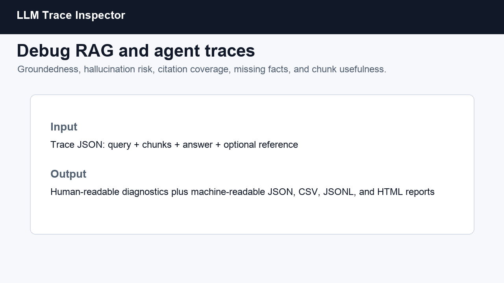
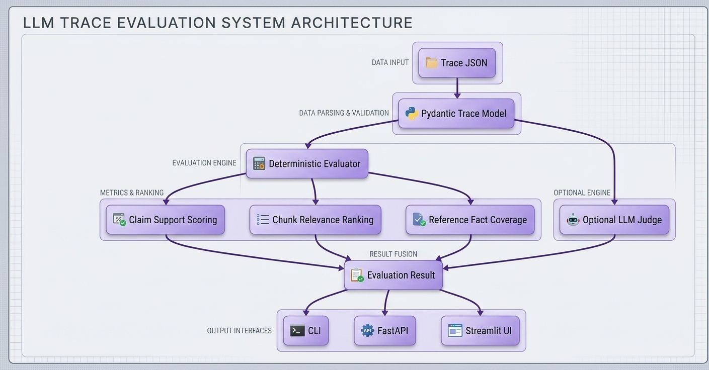

# LLM Trace Inspector

[](https://www.python.org/)
[](https://fastapi.tiangolo.com/)
[](https://typer.tiangolo.com/)
[](LICENSE)

LLM Trace Inspector is an open-source debugging tool for RAG and agent systems that turns a raw trace into an actionable quality report: groundedness, hallucination risk, context relevance, citation coverage, unsupported claims, missing facts, and chunk-level usefulness rankings.

## Why This Exists

LLM apps fail in ways normal logs do not explain. A model can answer fluently while ignoring retrieved context, inventing unsupported details, citing the wrong chunk, or missing the one fact the retriever should have supplied. LLM Trace Inspector gives developers a local-first way to inspect those failures before they ship.

## Demo



## Features

- Evaluate user query, retrieved chunks, generated answer, and optional reference answer
- Offline deterministic heuristics by default, so no API key is required
- Optional LLM-as-judge pass for stricter qualitative review
- FastAPI endpoint for service integration
- Typer CLI for CI and local debugging
- Streamlit UI for visual inspection
- JSON trace format designed for real RAG and agent pipelines

## Installation

```bash
git clone https://github.com/mahgoub/llm-trace-inspector.git
cd llm-trace-inspector
python -m venv .venv
source .venv/bin/activate
pip install -e ".[dev]"
```

## CLI Usage

```bash
llm-trace-inspector eval examples/rag_trace_good.json
llm-trace-inspector eval examples/rag_trace_hallucinated.json --output result.json
llm-trace-inspector eval examples/rag_trace_hallucinated.json --max-risk 0.4
llm-trace-inspector validate examples/rag_trace_good.json
llm-trace-inspector eval examples/rag_trace_good.json --html report.html
llm-trace-inspector eval-dir examples/ --output-dir reports --max-risk 0.6
```

Optional LLM judge:

```bash
export OPENAI_API_KEY=...
llm-trace-inspector eval examples/rag_trace_good.json --llm-judge
llm-trace-inspector eval examples/rag_trace_good.json \
  --llm-judge \
  --judge-model gpt-4o-mini \
  --judge-api-base https://api.openai.com/v1
```

## CI Thresholds

Use LLM Trace Inspector as a regression gate for RAG traces:

```yaml
- name: Evaluate RAG traces
  run: |
    llm-trace-inspector eval-dir examples/ --output-dir reports --max-risk 0.45
```

Or use the reusable GitHub Action:

```yaml
- uses: actions/checkout@v4
- uses: mahgoub/llm-trace-inspector@v0.3.1
  with:
    traces: examples
    max-risk: "0.45"
    min-groundedness: "0.70"
    min-citation-coverage: "0.50"
    output-dir: reports
    python-version: "3.12"
```

Marketplace note: this repository intentionally keeps the Action metadata at the root and does not include workflow files, matching GitHub Marketplace listing requirements for Actions.

The command exits non-zero when any trace exceeds `--max-risk`, while still writing:

- `summary.json`
- `results.jsonl`
- `results.csv`
- `report.html`

## Config File

Thresholds can live in `llm-trace-inspector.toml`:

```toml
[thresholds]
max_risk = 0.60
min_groundedness = 0.70
min_citation_coverage = 0.50
```

Use a custom config:

```bash
llm-trace-inspector eval-dir traces/regression --config eval.toml
```

## Trace Validation

Trace files can be validated before evaluation:

```bash
llm-trace-inspector validate examples/rag_trace_good.json
```

The JSON Schema lives at `schema/trace.schema.json` and is suitable for editor validation, CI checks, and trace producer integrations.

## API Usage

```bash
uvicorn llm_trace_inspector.api:app --reload
```

```bash
curl -X POST http://127.0.0.1:8000/eval \
  -H "Content-Type: application/json" \
  -d @examples/rag_trace_good.json
```

## Streamlit UI

```bash
streamlit run app/streamlit_app.py
```

## Example Input

```json
{
  "trace_id": "rag-good-001",
  "user_query": "What does the Acme Vector Cache do and when should teams use it?",
  "retrieved_context": [
    {
      "id": "chunk-1",
      "source": "docs/vector-cache.md",
      "text": "Acme Vector Cache stores embeddings and retrieval results for repeated semantic search queries."
    }
  ],
  "llm_answer": "Acme Vector Cache stores embeddings and retrieval results for repeated semantic search queries [chunk-1].",
  "reference_answer": "Acme Vector Cache stores embeddings and retrieval results for repeated semantic search queries."
}
```

## Example Output

```json
{
  "groundedness_score": 1.0,
  "hallucination_risk_score": 0.0,
  "relevance_score": 0.42,
  "citation_support_coverage": 1.0,
  "unsupported_claims": [],
  "missing_facts_from_context": [],
  "failure_modes": [],
  "citation_issues": [],
  "diagnostic_report": "Trace rag-good-001 has low hallucination risk..."
}
```

## Failure Taxonomy

The deterministic evaluator classifies common RAG and agent failures:

- `unsupported_claim`: answer claims are not supported by retrieved context
- `missing_retrieval`: reference facts are absent from retrieved chunks
- `irrelevant_retrieval`: retrieved chunks have low query relevance
- `citation_mismatch`: citations are missing, weak, or point to the wrong chunk
- `answer_drift`: answer content diverges from the reference answer
- `overconfident_refusal`: answer refuses despite relevant context being available

## Citation Formats

The citation parser resolves common formats against chunk IDs and sources:

```text
[chunk-1]
[^chunk-1]
(docs/vector-cache.md)
docs/vector-cache.md:12
```

It reports whether each claim is correctly cited, uncited, weakly cited, or citing the wrong chunk.

## Architecture



## Folder Structure

```text
llm-trace-inspector/
  action.yml                # Reusable GitHub Action
  app/                     # Streamlit frontend
  schema/                  # Trace JSON Schema
  examples/                # Example trace JSON files
  docs/                    # Demo, architecture, release notes
  src/llm_trace_inspector/ # Core package, API, CLI, evaluator
  tests/                   # Unit and API tests
  .github/ISSUE_TEMPLATE/  # GitHub issue templates
```

## Example Traces

- `rag_trace_good.json`: grounded answer with useful citations
- `rag_trace_hallucinated.json`: unsupported compliance and replication claims
- `missing_context.json`: retriever missed a necessary fact
- `irrelevant_chunks.json`: retrieved context does not match the query
- `bad_citations.json`: answer content is supported but cites the wrong chunk
- `agent_tool_error.json`: agent answered despite a failed tool lookup
- `partially_grounded_answer.json`: answer mixes supported and unsupported claims

## Roadmap

- Good first issue: add more example traces for common RAG failures
- Good first issue: add JSON schema docs for trace producers
- Good first issue: improve citation parsing for `source:page` formats
- Add SARIF export for GitHub code scanning annotations
- Add pytest plugin for regression testing RAG pipelines
- Add integrations for LangChain, LlamaIndex, Haystack, and OpenTelemetry traces
- Add semantic similarity backends for embeddings-based scoring
- Add side-by-side diff view for reference answer drift

## Contributing

Contributions are welcome. The best first contributions are new trace examples, evaluator edge cases, documentation fixes, and integration adapters.

1. Fork the repo
2. Create a feature branch
3. Add tests for behavior changes
4. Run `pytest`
5. Open a pull request with a clear before/after description

## License

MIT
